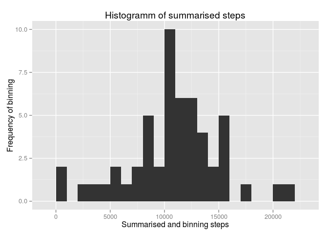
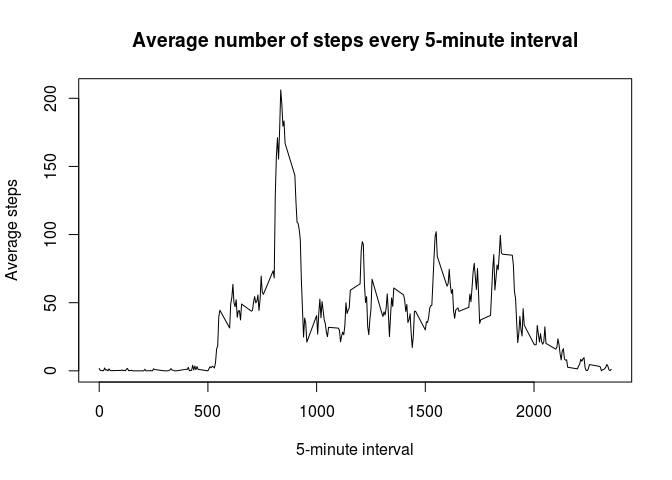
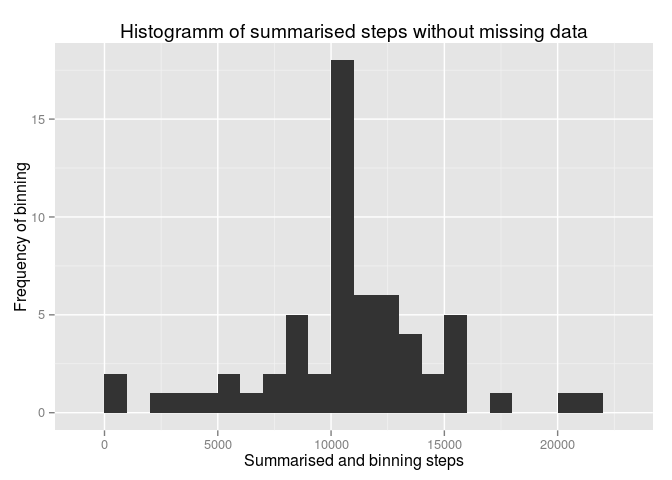
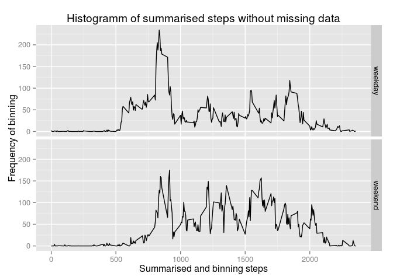

# Reproducible Research: Peer Assessment 1


## Loading and preprocessing the data

First we have to load the dataset. The GitHub repository also contains the dataset for this assignment so the file **activity.zip** is located in the working directory. We have do unzip and read the csv-data.  
The data is then transferred to the tbl-class of dplyr.


```r
library(dplyr);
d <- read.csv(unzip("activity.zip"), colClasse=c("integer","Date","integer"));
data <- tbl_df(d)
```

## What is mean total number of steps taken per day?

For this part, we can ignore the missing values in the dataset.

1. Calculate the total numbers of steps taken per day.

```r
groupDate <- group_by(data, date);
sumSteps <- summarize(groupDate, countSteps = sum(steps));
```

2. Make a histogram of the total number of steps taken each day.  
The binwidth is set to 1000.

```r
library(ggplot2);
ggplot(sumSteps, aes(countSteps)) +
  geom_histogram(binwidth = 1000) + 
  xlab("Summarised and binning steps") + 
  ylab("Frequency of binning") + 
  ggtitle("Histogramm of summarised steps");
```

 

3. Calculate and report the mean and median of the total number of steps taken per day.

```r
meanSteps <- mean(sumSteps$countSteps, na.rm=TRUE)
medianSteps <- median(sumSteps$countSteps, na.rm=TRUE)
```

The mean of the total number of steps taken per day is 1.0766189\times 10^{4} and the median is 10765.

## What is the average daily activity pattern?

1. Make a time series plot (i.e. type = "l") of the 5-minute interval (x-axis) and the average number of steps taken, averaged across all days (y-axis).

```r
groupInterval <- group_by(data, interval)
avgSteps <- summarise(groupInterval, avg = mean(steps, na.rm=TRUE))
plot(avgSteps$interval, avgSteps$avg, type="l", main="Average number of steps every 5-minute interval", xlab="5-minute interval", ylab="Average steps")
```

 

2. Which 5-minute interval, on average across all the days in the dataset, contains the maximum number of steps?


```r
maxInt <- max(avgSteps$avg)
maxInterval <- filter(avgSteps, avg == maxInt)
```

Based on the summarise in point 1 the **835th** 5-minute interval is the interval which contains the maximum number of **206.1698113** steps.

## Imputing missing values

1. Calculate and report the total number of missing values in the dataset (i.e. the total number of rows with NAs).


```r
count <- data %>% filter(is.na(steps)) %>% summarise(c=n())
```
There are 2304 missing values in the dataset.

2. Devise a strategy for filling in all of the missing values in the dataset. The strategy does not need to be sophisticated. For example, you could use the mean/median for that day, or the mean for that 5-minute interval, etc.

* First filter a table ___misval___ with all rows with missing values in the column steps.
* Second filter a table ___nomisval___ with all rows without missing values in the column steps.
* Third summarise the mean value of every 5-minute intervals from the table ___nomisval___. Use i as __integer__.
* Next join the table ___misval___ with the table ___nomisval___ by the 5-minute interval.
* Last bind the table ___misval___ and ___nomisval___.

3. Create a new dataset that is equal to the original dataset but with the missing data filled in.

Based on the strategy from he last point create the table ___tidydata___.

```r
misval <- filter(data, is.na(steps))
nomisval <- filter(data, !is.na(steps))
sumval <- nomisval %>% group_by(interval) %>% summarise(avg=mean(steps))
misval <- left_join(misval, sumval, by="interval")
misval$steps <- as.integer(misval$avg)
tidydata <- bind_rows(select(misval,steps:interval),nomisval) %>% arrange(date, interval)
```

4. Make a histogram of the total number of steps taken each day and Calculate and report the mean and median total number of steps taken per day. Do these values differ from the estimates from the first part of the assignment? What is the impact of imputing missing data on the estimates of the total daily number of steps?

```r
sumSteps <- tidydata %>% group_by(date) %>% summarize(countSteps = sum(steps))

ggplot(sumSteps, aes(countSteps)) +
  geom_histogram(binwidth = 1000) + 
  xlab("Summarised and binning steps") + 
  ylab("Frequency of binning") + 
  ggtitle("Histogramm of summarised steps without missing data")
```

 

```r
meanSteps <- mean(sumSteps$countSteps, na.rm=TRUE)
medianSteps <- median(sumSteps$countSteps, na.rm=TRUE)
```

The mean of the total number of steps taken per day without missing data is 1.074977\times 10^{4} and the median is 10641.

Based on the strategy the frequencies of the bind steps have increased as expected, the distribution has remained the same. The values for mean and median have changed only slightly. The missing values have little impact on the daily steps, if values for this days already existed.


## Are there differences in activity patterns between weekdays and weekends?

1. Create a new factor variable in the dataset with two levels – “weekday” and “weekend” indicating whether a given date is a weekday or weekend day.  
**Attention: This code works only with locale de.de**

```r
wd <- data %>% mutate(wd = weekdays(date)) %>% filter(wd %in% c("Montag", "Dienstag", "Mittwoch", "Donnerstag", "Freitag")) %>% mutate(weekday="weekday")
we <- data %>% mutate(wd = weekdays(date)) %>% filter(wd %in% c("Samstag", "Sonntag")) %>% mutate(weekday="weekend")
ddata <- bind_rows(select(wd, steps, date, interval, weekday), select(we, steps, date, interval, weekday))
```

2. Make a panel plot containing a time series plot (i.e. type = "l") of the 5-minute interval (x-axis) and the average number of steps taken, averaged across all weekday days or weekend days (y-axis).

```r
avgsteps <- ddata %>% group_by(interval, weekday) %>% summarise(avg = mean(steps, na.rm=TRUE))
ggplot(avgsteps, aes(interval,avg)) +
  geom_line() +
  facet_grid(weekday~.) +
  xlab("Summarised and binning steps") + 
  ylab("Frequency of binning") + 
  ggtitle("Histogramm of summarised steps without missing data")
```

 
